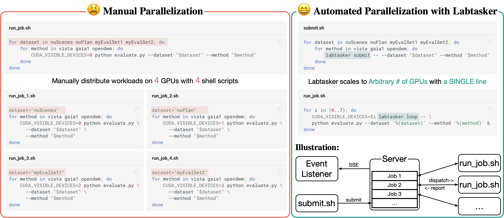

# Labtasker

## Introduction

Labtasker is an easy-to-use task queue tool designed to manage and dispatch lab experiment tasks to user-defined
workers.

!!! tip annotate "What *actually* is labtasker? When to use? What does it do?"

    Feeling confused? Here is a quick takeaway:

    **TLDR:** Replace `for` loops in your experiment *wrapper script* with labtasker to unlock a variety of powerful features (1)
    effortlessly.

    

1. Labtasker provides advanced features **with only 1 extra line of code:**
    - Load balancing and script parallelism
    - Dynamic task prioritization
    - Dynamic task cancellation
    - Failure auto-retry and worker suspension
    - Metadata recording
    - Event notification
    - And much more!

Integrating Labtasker into your existing experiment workflow requires just a few lines of boilerplate code.

To get started, check out the quick [Tutorial](./guide/basic.md) for an overview of the basic workflow.

To get an overview of the motivation of this tool, continue reading.

## Motivation

### Why not simple bash wrapper scripts?

**Running multiple lab experiments on a multiple GPUs (such as most AIGC experiments) can be tedious and inefficient.** Traditional scripts require manual splitting and offer limited control. Labtasker simplifies this process by allowing you to submit tasks to a server-based queue, which workers can fetch and execute.

Below is an example of how traditional wrapper scripts scale poorly.

Imagine you have multiple lab experiment jobs to run on a single GPU, such as for tasks like prompt engineering or
hyperparameter search.

The simplest approach is to write a script for each experiment and execute them sequentially.

```bash title="run_job.sh"
#!/bin/bash

for arg1 in 1 2 3 4; do
    for arg2 in 1 2 3 4; do
        for arg3 in 1 2 3 4; do
            python job_main.py --arg1 $arg1 --arg2 $arg2 --arg3 $arg3
        done
    done
done
```

This method works, but what if you have more than one worker/GPU?

Let's say you have 4 GPUs. You would probably split the experiments into 4 groups and run them in parallel to make
better use of the resources.

!!! example "This is already getting messy! 😰"

    <div class="grid" markdown>

    ```bash title="run_job_1.sh"
    #!/bin/bash

    arg1=1
    for arg2 in 1 2 3 4; do
        for arg3 in 1 2 3 4; do
            python job_main.py --arg1 $arg1 --arg2 $arg2 --arg3 $arg3
        done
    done
    ```

    ```bash title="run_job_2.sh"
    #!/bin/bash

    arg1=2
    for arg2 in 1 2 3 4; do
        for arg3 in 1 2 3 4; do
            python job_main.py --arg1 $arg1 --arg2 $arg2 --arg3 $arg3
        done
    done
    ```

    ```bash title="run_job_3.sh"
    #!/bin/bash

    arg1=3
    for arg2 in 1 2 3 4; do
        for arg3 in 1 2 3 4; do
            python job_main.py --arg1 $arg1 --arg2 $arg2 --arg3 $arg3
        done
    done
    ```

    ```bash title="run_job_4.sh"
    #!/bin/bash

    arg1=4
    for arg2 in 1 2 3 4; do
        for arg3 in 1 2 3 4; do
            python job_main.py --arg1 $arg1 --arg2 $arg2 --arg3 $arg3
        done
    done
    ```

    </div>

However, this method can quickly become tedious and offers limited control over the experiments once the job scripts are
running. Consider the following scenarios:

!!! question ""

    - How do you handle cases where the parameters are hard to divide evenly (e.g., 5x5x5 split across 3 GPUs), making it difficult to distribute the workload fairly?
    - What if your script crashes halfway and you have no idea of which experiments are complete?
    - What if you realize some scheduled experiments are unnecessary after reviewing the results? *(Stopping the script isn't ideal, as it would kill running jobs and make it hard to track which experiments are complete.)*
    - What if you want to reprioritize certain experiments based on initial results? You’d face the same issue as above.
    - How do you append extra experiment groups during script execution?
    - What if some experiments fail midway? *It can be challenging to untangle nested loops and identify completed tasks.*

Labtasker is designed to tackle these challenges elegantly, with minimal disruption to your existing workflow.

With Labtasker, you can submit a variety of experiment arguments to a server-based task queue. Worker nodes can then
fetch and execute these tasks directly from the queue.

### Why not SLURM?

Unlike traditional HPC resource management systems like SLURM, ==**Labtasker is tailored for users rather than system
administrators.**==

Labtasker is designed to be a simple and easy-to-use.

- It disentangles task queue from resource management.
- It offers a versatile task queue system that can be used by anyone (not just system administrators), without the need
  for extensive configuration or knowledge of HPC systems.

Here's are key conceptual differences between Labtasker and SLURM:

| Aspects           | SLURM                                                | Labtasker                                                                                            |
|-------------------|------------------------------------------------------|------------------------------------------------------------------------------------------------------|
| Purpose           | HPC resource management system                       | Task queue system for lab experiments                                                                |
| Who is it for     | Designed for system administrators                   | Designed for users                                                                                   |
| Configuration     | Requires extensive configuration                     | Minimal configuration needed                                                                         |
| Task Submission   | Jobs submitted as scripts with resource requirements | Tasks submitted as argument groups (pythonic dictionaries)                                           |
| Resource Handling | Allocates resources and runs the job                 | Does not explicitly handle resource allocation                                                       |
| Flexibility       | Assumes specific resource and task types             | No assumptions about task nature, experiment type, or computation resources                          |
| Execution         | Runs jobs on allocated resources                     | User-defined worker scripts run on various machines/GPUs/CPUs and decide how to handle the arguments |
| Reporting         | Handled by the framework                             | Reports results back to the server via API                                                           |
